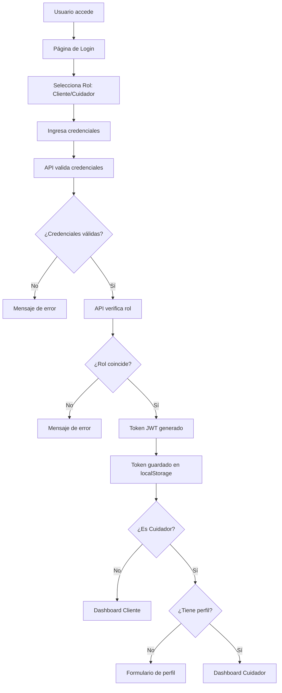
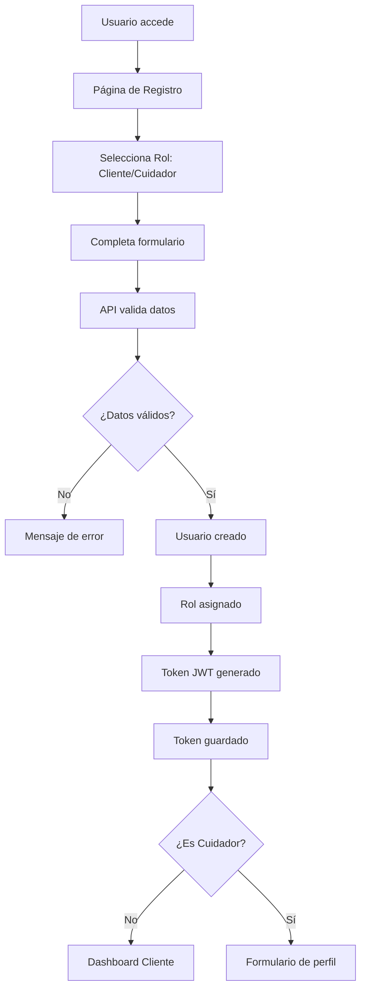
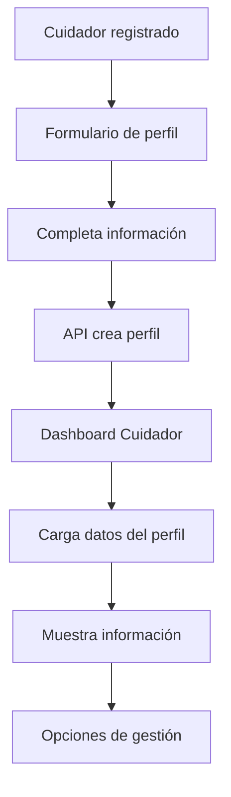

# 🔧 README de Mantenimiento - PetCare

## 📋 Índice
1. [Arquitectura del Sistema](#arquitectura-del-sistema)
2. [Flujo de la Aplicación](#flujo-de-la-aplicación)
3. [Estructura del Código](#estructura-del-código)
4. [Puntos de Mantenimiento](#puntos-de-mantenimiento)
5. [Debugging](#debugging)
6. [Modificaciones Comunes](#modificaciones-comunes)
7. [Troubleshooting](#troubleshooting)

---

## 🏗️ Arquitectura del Sistema

### Stack Tecnológico
- **Frontend**: React 18 + TypeScript + Vite + Bootstrap 5
- **Backend**: .NET 8 + Entity Framework + ASP.NET Identity
- **Base de Datos**: SQL Server
- **Autenticación**: JWT Tokens
- **Contenedores**: Docker + Docker Compose

### Estructura de Capas
```
Frontend (React) ←→ API (.NET) ←→ Base de Datos (SQL Server)
     ↓                    ↓                    ↓
  Componentes         Controllers          Tablas
  Services           Services             Migrations
  Types              Models               Identity
```

---

## 🔄 Flujo de la Aplicación

### 1. Flujo de Autenticación



### 2. Flujo de Registro



### 3. Flujo de Cuidador



---

## 📁 Estructura del Código

### Frontend (`PetCareFrond/`)

#### Componentes Principales
```
src/
├── App.tsx                    # Componente principal - Maneja navegación y estados
├── components/
│   ├── Layout.tsx            # Layout general con header/footer
│   ├── Header.tsx            # Header de navegación
│   ├── Footer.tsx            # Footer de la aplicación
│   ├── CuidadorForm.tsx      # Formulario de perfil de cuidador
│   └── cuidador/
│       └── CuidadorDashboard.tsx  # Dashboard específico de cuidador
├── services/
│   └── api.ts                # Servicios de comunicación con API
├── types/
│   ├── auth.ts               # Tipos para autenticación
│   └── cuidador.ts           # Tipos para cuidadores
└── index.css                 # Estilos globales
```

#### Flujo de Estados en App.tsx
```typescript
// Estados principales
const [currentView, setCurrentView] = useState<ViewType>('login');
const [loading, setLoading] = useState(false);
const [message, setMessage] = useState<{ text: string; type: 'success' | 'error' } | null>(null);
const [selectedRole, setSelectedRole] = useState<'Cliente' | 'Cuidador'>('Cliente');

// Estados de formularios
const [loginForm, setLoginForm] = useState<LoginRequestWithRole>({...});
const [registerForm, setRegisterForm] = useState<RegisterRequestWithRole>({...});
```

### Backend (`PetCareBackend/`)

#### Estructura de Capas
```
Controllers/           # Controladores de API
├── AuthController.cs  # Autenticación y registro
└── CuidadorController.cs  # Gestión de cuidadores

Services/              # Lógica de negocio
├── AuthService.cs     # Servicio de autenticación
├── CuidadorService.cs # Servicio de cuidadores
└── Interfaces/        # Contratos de servicios

Models/                # Modelos de datos
├── Auth/              # Modelos de autenticación
│   ├── User.cs        # Usuario
│   ├── UserRole.cs    # Rol de usuario
│   ├── Cuidador.cs    # Entidad cuidador
│   └── ...
└── AppSettings.cs     # Configuraciones

Data/                  # Acceso a datos
└── AppDbContext.cs    # Contexto de Entity Framework

Middleware/            # Middleware personalizado
└── JwtMiddleware.cs   # Configuración JWT
```

---

## 🔧 Puntos de Mantenimiento

### 1. Autenticación y Autorización

#### Archivos Clave:
- `PetCareBackend/Controllers/AuthController.cs`
- `PetCareBackend/Services/AuthService.cs`
- `PetCareBackend/Middleware/JwtMiddleware.cs`
- `PetCareFrond/src/services/api.ts`

#### Funciones Principales:
```csharp
// Backend - Generación de token
public string GenerateJwtToken(User user)
{
    // Configuración JWT
    // Claims del usuario
    // Firma del token
}

// Frontend - Gestión de token
authService.setToken(token);        // Guardar token
authService.getToken();             // Obtener token
authService.removeToken();          // Eliminar token
```

#### Modificaciones Comunes:
- Cambiar tiempo de expiración del token
- Agregar nuevos claims al token
- Modificar validaciones de contraseña
- Agregar nuevos roles

### 2. Gestión de Cuidadores

#### Archivos Clave:
- `PetCareBackend/Controllers/CuidadorController.cs`
- `PetCareBackend/Services/CuidadorService.cs`
- `PetCareBackend/Models/Auth/Cuidador.cs`
- `PetCareFrond/src/components/cuidador/CuidadorDashboard.tsx`

#### Funciones Principales:
```csharp
// Backend - Operaciones CRUD
await _cuidadorService.CreateCuidadorAsync(usuarioId, request);
await _cuidadorService.GetCuidadorByUsuarioIdAsync(usuarioId);
await _cuidadorService.UpdateCuidadorAsync(cuidadorId, request);

// Frontend - Servicios API
cuidadorService.createCuidador(data);
cuidadorService.getMiPerfil();
cuidadorService.updateMiPerfil(data);
```

#### Modificaciones Comunes:
- Agregar nuevos campos al perfil
- Modificar validaciones
- Agregar nuevas funcionalidades
- Cambiar lógica de verificación

### 3. Base de Datos

#### Archivos Clave:
- `PetCareBackend/Data/AppDbContext.cs`
- `Migrations/` (carpeta de migraciones)
- `appsettings.json`

#### Operaciones Comunes:
```bash
# Crear nueva migración
dotnet ef migrations add NombreMigracion

# Aplicar migraciones
dotnet ef database update

# Revertir migración
dotnet ef database update NombreMigracionAnterior
```

#### Estructura de Tablas:
```sql
-- Tabla de usuarios (Identity)
AspNetUsers (Id, UserName, Email, Name, CreatedAt)

-- Tabla de roles (Identity)
AspNetRoles (Id, Name, Description)

-- Tabla de cuidadores
Cuidadores (
    CuidadorID, UsuarioID, DocumentoIdentidad,
    TelefonoEmergencia, Biografia, Experiencia,
    HorarioAtencion, TarifaPorHora, CalificacionPromedio,
    DocumentoVerificado, FechaVerificacion, FechaCreacion
)
```

### 4. Frontend - Estados y Navegación

#### Archivos Clave:
- `PetCareFrond/src/App.tsx`
- `PetCareFrond/src/services/api.ts`
- `PetCareFrond/src/types/`

#### Estados Principales:
```typescript
// Tipos de vista
type ViewType = 'login' | 'register' | 'cuidador-form' | 'dashboard' | 'cuidador-dashboard';

// Estados de formularios
interface LoginRequestWithRole {
  email: string;
  password: string;
  role: 'Cliente' | 'Cuidador';
}
```

#### Flujo de Navegación:
```typescript
// Login exitoso
if (loginForm.role === 'Cuidador') {
  try {
    await cuidadorService.getMiPerfil();
    setCurrentView('cuidador-dashboard');  // Tiene perfil
  } catch (error) {
    setCurrentView('cuidador-form');       // No tiene perfil
  }
} else {
  setCurrentView('dashboard');             // Es cliente
}
```

---

## 🐛 Debugging

### 1. Problemas de Autenticación

#### Verificar Token:
```javascript
// En consola del navegador
console.log(localStorage.getItem('token'));
```

#### Verificar Headers:
```javascript
// En Network tab del navegador
// Verificar que Authorization header esté presente
```

#### Logs del Backend:
```bash
# Ver logs del contenedor
docker-compose logs petcare-api
```

### 2. Problemas de Base de Datos

#### Verificar Conexión:
```bash
# Verificar que la base de datos esté ejecutándose
docker ps | grep sqlserver

# Conectar a la base de datos
docker exec -it petcare-db /opt/mssql-tools/bin/sqlcmd -S localhost -U sa -P YourPassword123!
```

#### Verificar Migraciones:
```bash
# Ver migraciones aplicadas
dotnet ef migrations list

# Verificar estado de la base de datos
dotnet ef database update --dry-run
```

### 3. Problemas de CORS

#### Verificar Configuración:
```csharp
// En Program.cs
builder.Services.AddCors(options =>
{
    options.AddPolicy("AllowFrontend", policy =>
    {
        policy.WithOrigins("http://localhost:3000")
              .AllowAnyHeader()
              .AllowAnyMethod()
              .AllowCredentials();
    });
});

// Asegurar que se use antes de MapControllers
app.UseCors("AllowFrontend");
```

#### Verificar en Navegador:
```javascript
// En consola del navegador
// Buscar errores de CORS en Network tab
```

### 4. Problemas de Frontend

#### Verificar Estados:
```javascript
// En React DevTools
// Verificar estados de componentes
// Verificar props pasadas
```

#### Verificar API Calls:
```javascript
// En Network tab
// Verificar que las llamadas a la API sean correctas
// Verificar respuestas de la API
```

---

## 🔄 Modificaciones Comunes

### 1. Agregar Nuevo Campo a Cuidador

#### Backend:
1. **Modificar modelo** (`PetCareBackend/Models/Auth/Cuidador.cs`):
```csharp
public class Cuidador
{
    // ... campos existentes
    public string? NuevoCampo { get; set; }
}
```

2. **Actualizar DTOs** (`PetCareBackend/Models/Auth/CuidadorRequest.cs`):
```csharp
public class CuidadorRequest
{
    // ... campos existentes
    public string? NuevoCampo { get; set; }
}

public class CuidadorResponse
{
    // ... campos existentes
    public string? NuevoCampo { get; set; }
}
```

3. **Crear migración**:
```bash
dotnet ef migrations add AddNuevoCampoToCuidador
dotnet ef database update
```

#### Frontend:
1. **Actualizar tipos** (`PetCareFrond/src/types/cuidador.ts`):
```typescript
export interface CuidadorRequest {
  // ... campos existentes
  nuevoCampo?: string;
}

export interface CuidadorResponse {
  // ... campos existentes
  nuevoCampo?: string;
}
```

2. **Actualizar formulario** (`PetCareFrond/src/components/CuidadorForm.tsx`):
```typescript
// Agregar campo al estado
const [formData, setFormData] = useState<CuidadorRequest>({
  // ... campos existentes
  nuevoCampo: initialData?.nuevoCampo || ''
});

// Agregar input en el JSX
<div className="form-floating mb-3">
  <input
    type="text"
    className="form-control"
    id="nuevoCampo"
    value={formData.nuevoCampo || ''}
    onChange={(e) => handleInputChange('nuevoCampo', e.target.value)}
    placeholder="Nuevo campo"
  />
  <label htmlFor="nuevoCampo">Nuevo Campo</label>
</div>
```

3. **Actualizar dashboard** (`PetCareFrond/src/components/cuidador/CuidadorDashboard.tsx`):
```typescript
// Mostrar el nuevo campo en el dashboard
<div className="mb-2">
  <small className="text-muted">Nuevo Campo:</small>
  <p className="mb-1 fw-semibold">{cuidador.nuevoCampo || 'No especificado'}</p>
</div>
```

### 2. Agregar Nuevo Rol

#### Backend:
1. **Modificar controlador** (`PetCareBackend/Controllers/AuthController.cs`):
```csharp
// En el método Register
if (!await _roleManager.RoleExistsAsync(request.Role))
{
    await _roleManager.CreateAsync(new UserRole { Name = request.Role });
}
```

#### Frontend:
1. **Actualizar tipos** (`PetCareFrond/src/types/cuidador.ts`):
```typescript
export interface RegisterRequestWithRole {
  email: string;
  password: string;
  name: string;
  role: 'Cliente' | 'Cuidador' | 'NuevoRol';
}

export interface LoginRequestWithRole {
  email: string;
  password: string;
  role: 'Cliente' | 'Cuidador' | 'NuevoRol';
}
```

2. **Actualizar App.tsx**:
```typescript
const [selectedRole, setSelectedRole] = useState<'Cliente' | 'Cuidador' | 'NuevoRol'>('Cliente');

// Agregar opción en el selector de roles
<input
  type="radio"
  className="btn-check"
  name="loginRole"
  id="loginNuevoRol"
  checked={selectedRole === 'NuevoRol'}
  onChange={() => handleRoleChange('NuevoRol')}
/>
<label className="btn btn-outline-primary" htmlFor="loginNuevoRol">
  <i className="bi bi-star"></i> Nuevo Rol
</label>
```

### 3. Modificar Validaciones

#### Backend:
```csharp
// En PetCareBackend/Models/Auth/CuidadorRequest.cs
public class CuidadorRequest
{
    [Required]
    [StringLength(20)]
    public string DocumentoIdentidad { get; set; } = string.Empty;

    [Required]
    [StringLength(15)]
    [RegularExpression(@"^\+?[1-9]\d{1,14}$", ErrorMessage = "Formato de teléfono inválido")]
    public string TelefonoEmergencia { get; set; } = string.Empty;
}
```

#### Frontend:
```typescript
// En PetCareFrond/src/components/CuidadorForm.tsx
<input
  type="tel"
  className="form-control"
  id="telefonoEmergencia"
  value={formData.telefonoEmergencia}
  onChange={(e) => handleInputChange('telefonoEmergencia', e.target.value)}
  placeholder="+57 300 123 4567"
  pattern="^\+?[1-9]\d{1,14}$"
  title="Ingrese un número de teléfono válido"
  maxLength={15}
  required
/>
```

---

## 🚨 Troubleshooting

### Problemas Comunes

#### 1. Error de CORS
**Síntomas**: Error en consola del navegador sobre CORS
**Solución**:
```csharp
// Verificar configuración en Program.cs
builder.Services.AddCors(options =>
{
    options.AddPolicy("AllowFrontend", policy =>
    {
        policy.WithOrigins("http://localhost:3000")
              .AllowAnyHeader()
              .AllowAnyMethod()
              .AllowCredentials();
    });
});

// Asegurar que se use antes de MapControllers
app.UseCors("AllowFrontend");
```

#### 2. Token JWT Inválido
**Síntomas**: Error 401 en todas las peticiones autenticadas
**Solución**:
```bash
# Verificar configuración JWT en appsettings.json
{
  "Jwt": {
    "Key": "tu-clave-secreta-de-32-caracteres-minimo",
    "Issuer": "PetCare",
    "Audience": "PetCareUsers",
    "ExpirationHours": 24
  }
}
```

#### 3. Error de Migración
**Síntomas**: Error al aplicar migraciones
**Solución**:
```bash
# Revertir última migración
dotnet ef database update NombreMigracionAnterior

# Eliminar migración problemática
dotnet ef migrations remove

# Crear nueva migración
dotnet ef migrations add NuevaMigracion
dotnet ef database update
```

#### 4. Frontend No Se Conecta al Backend
**Síntomas**: Error de conexión en Network tab
**Solución**:
```typescript
// Verificar URL en PetCareFrond/src/services/api.ts
const API_BASE_URL = 'http://localhost:5000/api';

// Verificar que el backend esté ejecutándose
docker ps | grep petcare-api

// Verificar logs del backend
docker-compose logs petcare-api
```

#### 5. Error de Validación de Formulario
**Síntomas**: Formularios no se envían aunque parezcan válidos
**Solución**:
```typescript
// Verificar validación en el frontend
const handleSubmit = (event: React.FormEvent<HTMLFormElement>) => {
  event.preventDefault();
  event.stopPropagation();
  
  const form = event.currentTarget;
  if (form.checkValidity() === false) {
    setValidated(true);
    return;
  }
  // ... resto del código
};
```

---

## 📞 Contacto y Soporte

- **Documentación**: Este README
- **Issues**: [GitHub Issues](https://github.com/WooshC/PetCareServicios/issues)
- **Email**: soporte@petcare.com

---

<div align="center">
  <p>🔧 <strong>¡Mantenimiento Documentado!</strong></p>
  <p>📚 Flujos y Estructuras Claros</p>
  <p>🐛 Debugging y Troubleshooting</p>
  <p>🔄 Guías de Modificación</p>
</div> 