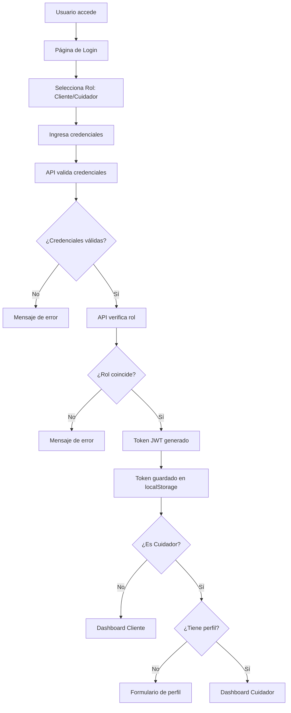
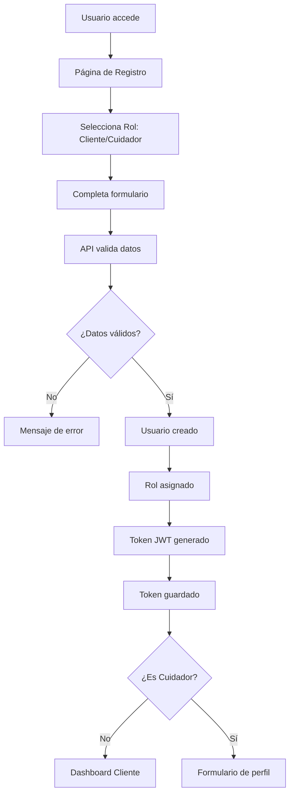
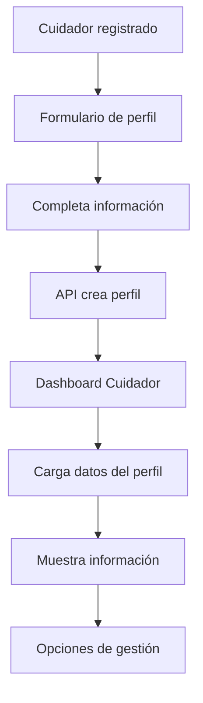

# 🔧 README de Mantenimiento - PetCare

## 📋 Índice
1. [Arquitectura del Sistema](#arquitectura-del-sistema)
2. [Flujo de la Aplicación](#flujo-de-la-aplicación)
3. [Estructura del Código](#estructura-del-código)
4. [Puntos de Mantenimiento](#puntos-de-mantenimiento)
5. [Debugging](#debugging)
6. [Modificaciones Comunes](#modificaciones-comunes)
7. [Troubleshooting](#troubleshooting)

---

## 🏗️ Arquitectura del Sistema

### Stack Tecnológico
- **Frontend**: React 18 + TypeScript + Vite + Bootstrap 5
- **Backend**: .NET 8 + Entity Framework + ASP.NET Identity
- **Base de Datos**: SQL Server (dos bases separadas)
- **Autenticación**: JWT Tokens
- **Contenedores**: Docker + Docker Compose

### Estructura de Capas
```
Frontend (React) ←→ API (.NET) ←→ Base de Datos (SQL Server)
     ↓                    ↓                    ↓
  Componentes         Controllers          Tablas
  Services           Services             Migrations
  Types              Models               Identity
```

### Base de Datos Separada
El sistema utiliza **dos bases de datos separadas** para mejor organización:

1. **PetCareAuth** - Autenticación y usuarios
   - `AspNetUsers` - Usuarios del sistema
   - `AspNetRoles` - Roles disponibles
   - `AspNetUserRoles` - Asignación de roles

2. **PetCareCuidadores** - Gestión de cuidadores
   - `Cuidadores` - Perfiles de cuidadores

---

## 🔄 Flujo de la Aplicación

### 1. Flujo de Autenticación



### 2. Flujo de Registro



### 3. Flujo de Cuidador



---

## 📁 Estructura del Código

### Frontend (`PetCareFrond/`)

#### Componentes Principales
```
src/
├── App.tsx                    # Componente principal - Maneja navegación y estados
├── components/
│   ├── Layout.tsx            # Layout general con header/footer
│   ├── Header.tsx            # Header de navegación
│   ├── Footer.tsx            # Footer de la aplicación
│   ├── CuidadorForm.tsx      # Formulario de perfil de cuidador
│   └── cuidador/
│       └── CuidadorDashboard.tsx  # Dashboard específico de cuidador
├── services/
│   └── api.ts                # Servicios de comunicación con API
├── types/
│   ├── auth.ts               # Tipos para autenticación
│   └── cuidador.ts           # Tipos para cuidadores
└── index.css                 # Estilos globales
```

#### Flujo de Estados en App.tsx
```typescript
// Estados principales
const [currentView, setCurrentView] = useState<ViewType>('login');
const [loading, setLoading] = useState(false);
const [message, setMessage] = useState<{ text: string; type: 'success' | 'error' } | null>(null);
const [selectedRole, setSelectedRole] = useState<'Cliente' | 'Cuidador'>('Cliente');

// Estados de formularios
const [loginForm, setLoginForm] = useState<LoginRequestWithRole>({...});
const [registerForm, setRegisterForm] = useState<RegisterRequestWithRole>({...});
```

### Backend (`PetCareBackend/`)

#### Estructura de Capas
```
Controllers/           # Controladores de API
├── AuthController.cs  # Autenticación y registro
└── CuidadorController.cs  # Gestión de cuidadores

Services/              # Lógica de negocio
├── AuthService.cs     # Servicio de autenticación
├── CuidadorService.cs # Servicio de cuidadores
└── Interfaces/        # Contratos de servicios

Models/                # Modelos de datos
├── Auth/              # Modelos de autenticación
│   ├── User.cs        # Usuario (Identity)
│   ├── UserRole.cs    # Rol de usuario
│   ├── LoginRequest.cs # Solicitud de login
│   └── AuthResponse.cs # Respuesta de autenticación
├── Cuidadores/        # Modelos de cuidadores
│   ├── Cuidador.cs    # Entidad cuidador
│   └── CuidadorRequest.cs # DTOs
└── AppSettings.cs     # Configuraciones

Data/                  # Acceso a datos
├── AppDbContext.cs    # Contexto de autenticación
└── CuidadoresDbContext.cs # Contexto de cuidadores

Middleware/            # Middleware personalizado
└── JwtMiddleware.cs   # Configuración JWT
```

---

## 🔧 Puntos de Mantenimiento

### 1. Autenticación y Autorización

#### Archivos Clave:
- `PetCareBackend/Controllers/AuthController.cs`
- `PetCareBackend/Services/AuthService.cs`
- `PetCareBackend/Middleware/JwtMiddleware.cs`
- `PetCareFrond/src/services/api.ts`

#### Funciones Principales:
```csharp
// Backend - Generación de token
public string GenerateJwtToken(User user)
{
    // Configuración JWT
    // Claims del usuario
    // Firma del token
}

// Frontend - Gestión de token
authService.setToken(token);        // Guardar token
authService.getToken();             // Obtener token
authService.removeToken();          // Eliminar token
```

#### Modificaciones Comunes:
- Cambiar tiempo de expiración del token
- Agregar nuevos claims al token
- Modificar validaciones de contraseña
- Agregar nuevos roles

### 2. Gestión de Cuidadores

#### Archivos Clave:
- `PetCareBackend/Controllers/CuidadorController.cs`
- `PetCareBackend/Services/CuidadorService.cs`
- `PetCareBackend/Models/Cuidadores/Cuidador.cs`
- `PetCareFrond/src/components/cuidador/CuidadorDashboard.tsx`

#### Funciones Principales:
```csharp
// Backend - Operaciones CRUD
await _cuidadorService.CreateCuidadorAsync(usuarioId, request);
await _cuidadorService.GetCuidadorByUsuarioIdAsync(usuarioId);
await _cuidadorService.UpdateCuidadorAsync(cuidadorId, request);

// Frontend - Servicios de API
await cuidadorService.createCuidador(data);
await cuidadorService.getMiPerfil();
await cuidadorService.updateMiPerfil(data);
```

#### Modificaciones Comunes:
- Agregar nuevos campos al perfil de cuidador
- Modificar validaciones de datos
- Cambiar lógica de verificación
- Agregar nuevas funcionalidades al dashboard

### 3. Base de Datos

#### Archivos Clave:
- `PetCareBackend/Data/AppDbContext.cs`
- `PetCareBackend/Data/CuidadoresDbContext.cs`
- `Migrations/Auth/`
- `Migrations/Cuidadores/`

#### Comandos de Migración:
```bash
# Crear migración para autenticación
dotnet ef migrations add NombreMigracion --context AppDbContext

# Crear migración para cuidadores
dotnet ef migrations add NombreMigracion --context CuidadoresDbContext

# Aplicar migraciones
dotnet ef database update --context AppDbContext
dotnet ef database update --context CuidadoresDbContext
```

#### Modificaciones Comunes:
- Agregar nuevas tablas
- Modificar esquemas existentes
- Agregar índices para optimización
- Cambiar relaciones entre entidades

### 4. Frontend - Estados y Navegación

#### Archivos Clave:
- `PetCareFrond/src/App.tsx`
- `PetCareFrond/src/services/api.ts`
- `PetCareFrond/src/types/`

#### Estados Principales:
```typescript
// Vista actual
const [currentView, setCurrentView] = useState<ViewType>('login');

// Estados de formularios
const [loginForm, setLoginForm] = useState<LoginRequestWithRole>({...});
const [registerForm, setRegisterForm] = useState<RegisterRequestWithRole>({...});

// Estados de carga y mensajes
const [loading, setLoading] = useState(false);
const [message, setMessage] = useState<{ text: string; type: 'success' | 'error' } | null>(null);
```

#### Modificaciones Comunes:
- Agregar nuevas vistas
- Modificar flujo de navegación
- Cambiar validaciones de formularios
- Agregar nuevos tipos de mensajes

---

## 🐛 Debugging

### 1. Debugging del Backend

#### Logs de Desarrollo
```bash
# Ver logs detallados
dotnet run --environment Development

# Ver logs de Entity Framework
# Agregar en appsettings.Development.json:
{
  "Logging": {
    "LogLevel": {
      "Default": "Information",
      "Microsoft.EntityFrameworkCore.Database.Command": "Information"
    }
  }
}
```

#### Debugging con Docker
```bash
# Ver logs en tiempo real
docker-compose logs -f petcare-api

# Ejecutar comandos en contenedor
docker-compose exec petcare-api dotnet ef database update
```

#### Puntos de Breakpoint Comunes:
- `AuthController.Login()` - Validación de credenciales
- `AuthController.Register()` - Creación de usuarios
- `CuidadorController.CreateCuidador()` - Creación de perfiles
- `AuthService.GenerateJwtToken()` - Generación de tokens

### 2. Debugging del Frontend

#### Herramientas de Desarrollo
```bash
# Ejecutar en modo desarrollo
npm run dev

# Ver logs en consola del navegador
# Usar React Developer Tools
# Usar Network tab para ver requests
```

#### Puntos de Breakpoint Comunes:
- `App.tsx - handleLogin()` - Proceso de login
- `App.tsx - handleRegister()` - Proceso de registro
- `api.ts - interceptors` - Manejo de tokens
- `CuidadorDashboard.tsx - loadCuidadorProfile()` - Carga de datos

### 3. Debugging de Base de Datos

#### Conectar a SQL Server
```bash
# Conectar desde Docker
docker exec -it petcareservicios-db-1 /opt/mssql-tools/bin/sqlcmd -S localhost -U sa -P YourStrong@Passw0rd

# Consultas útiles
SELECT * FROM AspNetUsers;
SELECT * FROM Cuidadores;
SELECT * FROM AspNetRoles;
```

#### Verificar Migraciones
```bash
# Ver migraciones aplicadas
dotnet ef migrations list --context AppDbContext
dotnet ef migrations list --context CuidadoresDbContext
```

---

## 🔄 Modificaciones Comunes

### 1. Agregar Nuevo Campo a Cuidador

#### Backend:
1. **Modificar modelo** `PetCareBackend/Models/Cuidadores/Cuidador.cs`
2. **Crear migración**:
   ```bash
   dotnet ef migrations add AgregarNuevoCampo --context CuidadoresDbContext
   ```
3. **Aplicar migración**:
   ```bash
   dotnet ef database update --context CuidadoresDbContext
   ```
4. **Actualizar DTOs** en `CuidadorRequest.cs` y `CuidadorResponse.cs`
5. **Modificar servicio** `CuidadorService.cs`

#### Frontend:
1. **Actualizar tipos** en `PetCareFrond/src/types/cuidador.ts`
2. **Modificar formulario** en `CuidadorForm.tsx`
3. **Actualizar dashboard** en `CuidadorDashboard.tsx`

### 2. Agregar Nuevo Rol

#### Backend:
1. **Crear rol en migración** o agregar en `Program.cs`
2. **Actualizar validaciones** en `AuthController.cs`
3. **Modificar lógica de autorización**

#### Frontend:
1. **Actualizar tipos** para incluir nuevo rol
2. **Modificar selectores** de rol en formularios
3. **Agregar lógica** de navegación específica

### 3. Modificar Validaciones

#### Backend:
```csharp
// En AuthService.cs
public async Task<AuthResponse> RegisterAsync(User user, string password)
{
    // Agregar validaciones personalizadas
    if (string.IsNullOrEmpty(user.Name))
    {
        return new AuthResponse { Success = false, Message = "El nombre es requerido" };
    }
    
    // Resto de la lógica...
}
```

#### Frontend:
```typescript
// En formularios
const handleSubmit = (event: React.FormEvent<HTMLFormElement>) => {
    const form = event.currentTarget;
    if (form.checkValidity() === false) {
        setValidated(true);
        return;
    }
    
    // Validaciones adicionales
    if (formData.password.length < 8) {
        setMessage({ text: 'La contraseña debe tener al menos 8 caracteres', type: 'error' });
        return;
    }
    
    // Resto de la lógica...
};
```

### 4. Agregar Nueva Vista

#### Frontend:
1. **Crear componente** en `src/components/`
2. **Agregar tipo** en `App.tsx`:
   ```typescript
   type ViewType = 'login' | 'register' | 'cuidador-form' | 'dashboard' | 'cuidador-dashboard' | 'nueva-vista';
   ```
3. **Agregar lógica** de navegación
4. **Crear renderizado** en `renderContent()`

---

## 🐛 Troubleshooting

### Problemas Comunes

#### 1. Error de CORS
**Síntomas**: Error en consola del navegador sobre CORS
**Solución**:
```csharp
// Verificar configuración en Program.cs
builder.Services.AddCors(options =>
{
    options.AddPolicy("AllowFrontend", policy =>
    {
        policy.WithOrigins("http://localhost:3000")
              .AllowAnyHeader()
              .AllowAnyMethod()
              .AllowCredentials();
    });
});
```

#### 2. Error de Autenticación
**Síntomas**: 401 Unauthorized en requests
**Solución**:
```bash
# Verificar token en localStorage
localStorage.getItem('token')

# Verificar configuración JWT
# Revisar logs del backend
docker-compose logs petcare-api
```

#### 3. Error de Base de Datos
**Síntomas**: Error "Invalid object name"
**Solución**:
```bash
# Aplicar migraciones
dotnet ef database update --context AppDbContext
dotnet ef database update --context CuidadoresDbContext

# O reiniciar contenedores
docker-compose down
docker-compose up -d
```

#### 4. Frontend No Se Conecta
**Síntomas**: Error de conexión en Network tab
**Solución**:
```bash
# Verificar que el backend esté ejecutándose
curl http://localhost:5000/api/auth/health

# Verificar URL en servicios de API
# Revisar configuración de proxy en vite.config.ts
```

#### 5. Error de Migración
**Síntomas**: Error al aplicar migraciones
**Solución**:
```bash
# Revertir migración problemática
dotnet ef database update NombreMigracionAnterior --context AppDbContext

# Eliminar migración
dotnet ef migrations remove --context AppDbContext

# Crear nueva migración
dotnet ef migrations add NuevaMigracion --context AppDbContext
```

### Comandos de Recuperación

#### Reconstruir Todo
```bash
# Detener contenedores
docker-compose down

# Limpiar volúmenes (cuidado: elimina datos)
docker-compose down -v

# Reconstruir
docker-compose up --build -d
```

#### Limpiar Frontend
```bash
cd PetCareFrond
rm -rf node_modules package-lock.json
npm install
npm run dev
```

#### Resetear Base de Datos
```bash
# Eliminar volúmenes
docker-compose down -v

# Recrear contenedores
docker-compose up -d

# Aplicar migraciones
docker-compose exec petcare-api dotnet ef database update --context AppDbContext
docker-compose exec petcare-api dotnet ef database update --context CuidadoresDbContext
```

---

## 📊 Monitoreo y Logs

### Logs Útiles
```bash
# Backend en tiempo real
docker-compose logs -f petcare-api

# Base de datos
docker-compose logs -f petcare-db

# Todos los servicios
docker-compose logs -f
```

### Métricas de Rendimiento
- **Tiempo de respuesta** de endpoints
- **Uso de memoria** de contenedores
- **Conexiones a base de datos**
- **Errores de autenticación**

### Alertas Recomendadas
- **Backend no responde** (puerto 5000)
- **Base de datos no accesible** (puerto 14433)
- **Errores de migración**
- **Tokens JWT expirados**

---

<div align="center">
  <p>🔧 <strong>Mantenimiento PetCare</strong></p>
  <p>✨ Debugging + Modificaciones + Troubleshooting</p>
  <p>🐛 Solución de Problemas</p>
  <p>📊 Monitoreo y Logs</p>
</div> 